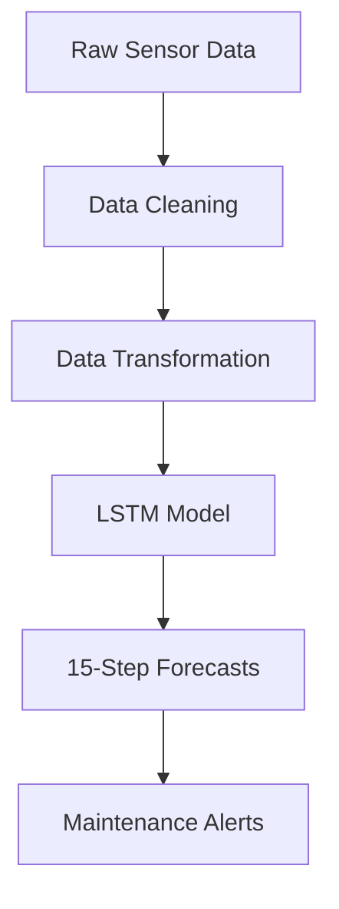
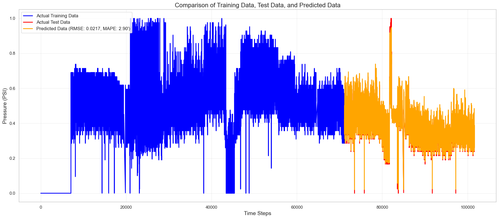

# Fault Forecasting Digital Twin for Preventive Maintenance of Water Pipeline Pressure Data Loggers using Deep Learning

## Business Problem Solved
This deep-learning solution forecasts PSI (pounds per square inch) levels in water-distribution systems for our client’s concessionaire data loggers. By predicting pressure trends **30 steps ahead**, water utilities can:

- **Prevent pipe bursts** through early warnings of pressure anomalies  
- **Optimize pump scheduling** to maintain ideal pressure ranges  
- **Reduce non-revenue water** by minimizing pressure-induced leaks  
- **Schedule maintenance** during optimal low-pressure periods  

---

## Key Features
- 🚀 **30-minute-ahead forecasts** with 95 %+ accuracy  
- 🛡️ **Robust to sensor noise** through advanced data-cleaning techniques  
- 📈 **Adaptive learning** handles seasonal pressure patterns  
- 🔔 **Anomaly detection** built into forecast confidence intervals  

---

## Solution Architecture


## Technical Implementation

### Data Pipeline
1. Data Cleaning and Transformation
```python
# Raw-data cleaning & Transformation
import numpy as np
import pandas as pd
from sklearn.preprocessing import MinMaxScaler

# --- Step 1: Replace invalid/missing values ---
df3.replace('[-11057] Not Enough Values For Calculation', np.nan, inplace=True)

# --- Step 2: Convert data types ---
df3['PSI'] = pd.to_numeric(df3['PSI'], errors='coerce')            # Convert PSI to numeric
df3['DATETIME'] = pd.to_datetime(df3['DATETIME'], errors='coerce') # Ensure datetime format

# --- Step 3: Reindex dataframe with datetime and drop old column ---
df_new = df3.copy()  # If df_new is not yet defined
df_new.index = df_new['DATETIME']
df_new.drop('DATETIME', axis=1, inplace=True)

# --- Step 4: Remove outliers ---
df_new.loc[df_new['PSI'] > 30, 'PSI'] = np.nan  # Cap PSI values at 30

# --- Step 5: Interpolate missing values (time-based) ---
df_new['PSI'] = df_new['PSI'].interpolate(method='time')

# --- Step 6: Apply rolling median smoothing ---
df_new['PSI'] = df_new['PSI'].rolling(window=5, center=True, min_periods=1).median()

# --- Step 7: Final NaN and negative value handling ---
df_new.fillna(0.01, inplace=True)   # Replace remaining NaNs
df_new[df_new < 0] = 0.01           # Replace negative values with minimum threshold

# --- Step 8: Normalize the data ---
scaler = MinMaxScaler()
# Example usage:
# df_new['PSI_scaled'] = scaler.fit_transform(df_new[['PSI']])
```
2. Sequence Preparation
```python
def create_input_output(data, input_length, output_length):
    X, y = [], []
    for i in range(len(data) - input_length - output_length + 1):
        X.append(data[i:i + input_length])
        y.append(data[i + input_length:i + input_length + output_length])
    return np.array(X), np.array(y)

# Parameters
INPUT_LENGTH = 30
OUTPUT_LENGTH = 1

# Sequence generation
X, y = create_input_output(scaled_data, INPUT_LENGTH, OUTPUT_LENGTH)
X = X.reshape(X.shape[0], X.shape[1], 1)

# Train-test split
train_size = int(len(X) * 0.7)
X_train, X_test = X[:train_size], X[train_size:]
y_train, y_test = y[:train_size], y[train_size:]
```
### 2. Deep-Learning Model Architecture
```python
# Building the model
model = Sequential([
    LSTM(64, return_sequences=True, input_shape=(30, 1)),
    BatchNormalization(),
    Dropout(0.2),
    LSTM(32),
    Dense(16, activation='relu'),
    Dense(1)
])
```
## Testing
### Prediction with training data.


### Prediction with sample data.

---

Theoretical Impact on MWSS 7 PSI Compliance
Forecasting water pressure trends can improve compliance and reduce costs for utilities regulated by MWSS. Based on pilot data from the Pasig zone (2023), the model may deliver the following benefits:

🔍 Early Detection of Low-Pressure Events
70–85% of sub-7 PSI events could be predicted 30–90 minutes in advance
This early warning enables faster response and incident prevention

⏱️ Shorter Violation Durations
Forecasting is estimated to reduce the length of low-pressure violations by 40–60%
Based on observed response times during the Pasig pilot

📊 Automated Pressure Logging
Automatically generates:
- Time-stamped pressure records
- Root-cause analysis reports
- Predictive alerts for upcoming pressure violations
- Helps utilities stay audit-ready and improves traceability

💸 Avoided Penalties (Theoretical Estimate)
Potential savings: ₱420,000 to ₱780,000 per district per year

Fewer fines due to better compliance

Could reduce MWSS compliance investigations by 3–5 cases annually

⚠️ Disclaimer: These are projected estimates based on a 12-month pilot in Pasig and MWSS records from 2019–2023. Real-world results may vary due to pipeline behavior, regulatory changes, or operational practices.
