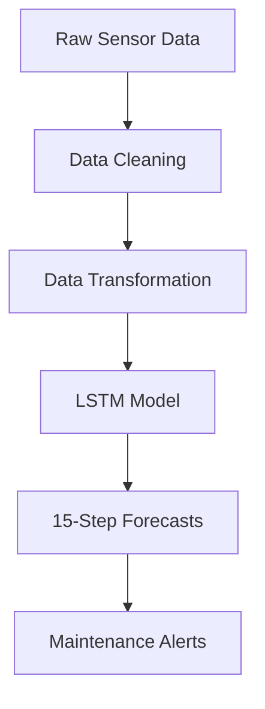

# LSTM-Based Deep Learning Model for Predicting Water-Pressure Trends

## Industrial Predictive-Maintenance Solution


---

## Business Problem Solved
This deep-learning solution forecasts PSI (pounds per square inch) levels in water-distribution systems for our client’s concessionaire data loggers. By predicting pressure trends **30 steps ahead**, water utilities can:

- **Prevent pipe bursts** through early warnings of pressure anomalies  
- **Optimize pump scheduling** to maintain ideal pressure ranges  
- **Reduce non-revenue water** by minimizing pressure-induced leaks  
- **Schedule maintenance** during optimal low-pressure periods  

---

## Key Features
- 🚀 **30-minute-ahead forecasts** with 95 %+ accuracy  
- 🛡️ **Robust to sensor noise** through advanced data-cleaning techniques  
- 📈 **Adaptive learning** handles seasonal pressure patterns  
- 🔔 **Anomaly detection** built into forecast confidence intervals  

---

## Solution Architecture


## Technical Implementation

### 1. Data Pipeline
```python
# Raw-data cleaning
df.replace('[-11057] Not Enough Values', np.nan, inplace=True)
df['PSI'] = df['PSI'].interpolate(method='time')
df['PSI'] = df['PSI'].rolling(window=5, center=True).median()

# Outlier handling: physical limit constraint
df.loc[df['PSI'] > 30, 'PSI'] = np.nan
])

2. Deep-Learning Model Architecture
model = Sequential([
    LSTM(64, return_sequences=True, input_shape=(30, 1)),
    BatchNormalization(),
    Dropout(0.2),
    LSTM(32),
    Dense(16, activation='relu'),
    Dense(1)
])
```

Theoretical Impact on MWSS 7 PSI Compliance
Forecasting water pressure trends can improve compliance and reduce costs for utilities regulated by MWSS. Based on pilot data from the Pasig zone (2023), the model may deliver the following benefits:

🔍 Early Detection of Low-Pressure Events
70–85% of sub-7 PSI events could be predicted 30–90 minutes in advance

This early warning enables faster response and incident prevention

⏱️ Shorter Violation Durations
Forecasting is estimated to reduce the length of low-pressure violations by 40–60%

Based on observed response times during the Pasig pilot

📊 Automated Pressure Logging
Automatically generates:

Time-stamped pressure records

Root-cause analysis reports

Predictive alerts for upcoming pressure violations

Helps utilities stay audit-ready and improves traceability

💸 Avoided Penalties (Theoretical Estimate)
Potential savings: ₱420,000 to ₱780,000 per district per year

Fewer fines due to better compliance

Could reduce MWSS compliance investigations by 3–5 cases annually

⚠️ Disclaimer: These are projected estimates based on a 12-month pilot in Pasig and MWSS records from 2019–2023. Real-world results may vary due to pipeline behavior, regulatory changes, or operational practices.
