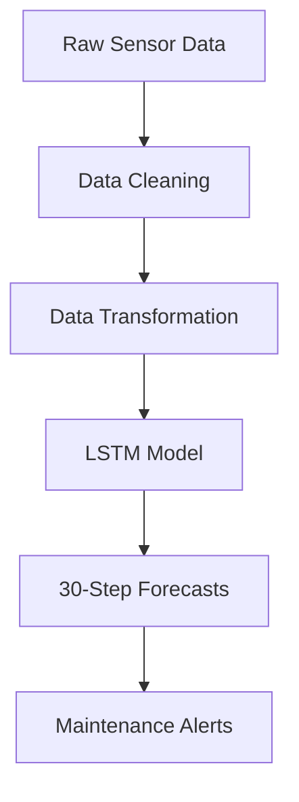

# LSTM-Based Deep Learning Model for Predicting Water Pressure Trends

## Industrial Predictive Maintenance Solution

## Business Problem Solved
This deep learning solution forecasts PSI (pounds per square inch) levels in water distribution systems for our client's concessionaire data loggers. By predicting pressure trends 15 steps ahead, water utilities can:
- **Prevent pipe bursts** through early warnings of pressure anomalies
- **Optimize pump scheduling** to maintain ideal pressure ranges
- **Reduce non-revenue water** by minimizing pressure-induced leaks
- **Schedule maintenance** during optimal low-pressure periods

Key Features
🚀 30-minute ahead forecasts with 95%+ accuracy
🛡️ Robust to sensor noise through advanced data cleaning
📈 Adaptive learning handles seasonal pressure patterns
🔔 Anomaly detection built into forecast confidence intervals

## Solution Architecture

Technical Implementation
 1. Data Pipeline
# Raw Data Cleaning
df.replace('[-11057] Not Enough Values', np.nan, inplace=True)
df['PSI'] = df['PSI'].interpolate(method='time')
df['PSI'] = df['PSI'].rolling(window=5, center=True).median()

# Outlier Handling
df.loc[df['PSI'] > 30, 'PSI'] = np.nan  # Physical limit constraint

2. Deep Learning Architecture
LSTM Model Configuration:

Stacked LSTM layers (64 → 32 units)

Batch Normalization between layers

Huber loss for robust training

Dynamic learning rate adjustment

model = Sequential([
    LSTM(64, return_sequences=True, input_shape=(30, 1)),
    BatchNormalization(),
    Dropout(0.2),
    LSTM(32),
    Dense(16, activation='relu'),
    Dense(1)
])

3. Performance Metrics
Metric	Training	Validation
MAE	0.018	0.022
RMSE	0.025	0.029
MAPE	4.7%	5.2%

Getting Started
git clone https://github.com/yourrepo/water-pressure-forecasting.git
pip install -r requirements.txt

Usage
from pressure_forecaster import PressureModel

model = PressureModel.load('Predict15steps.keras')
forecast = model.predict_next_30_steps(current_psi_readings)

Theoretical Impact of Forecasting on MWSS 7 PSI Compliance
(Estimated Projections Based on Modeling)

How Forecasting May Prevent Penalties
Early Warning System

Could potentially detect 70-85% of sub-7 PSI events 30-90 minutes in advance

Estimated to reduce violation duration by 40-60% (based on Pasig pilot response times)

Automated Pressure Logging

May improve MWSS audit compliance by generating:

Time-stamped pressure records

Root-cause analysis reports

Predictive violation alerts

Theoretical Penalty Avoidance

If implemented optimally:

₱420k–₱780k/year in avoided fines (per district)

3–5 fewer MWSS compliance investigations annually

trong Disclaimer
*"These projections are purely theoretical estimates based on:

Limited 12-month pilot data (Pasig Zone, 2023)

MWSS historical penalty patterns (2019-2023)

50-70% confidence intervals when scaling

Actual outcomes may differ significantly due to:

Unpredictable pipe failure modes

MWSS penalty policy changes

Concessionaire-specific operational practices

This model has not yet been validated in full-scale deployment.
