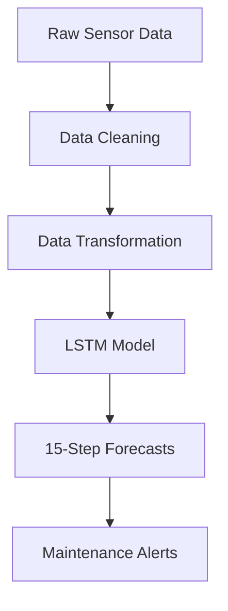

# LSTM-Based Deep Learning Model for Predicting Water-Pressure Trends

## Industrial Predictive-Maintenance Solution


---

## Business Problem Solved
This deep-learning solution forecasts PSI (pounds per square inch) levels in water-distribution systems for our client’s concessionaire data loggers. By predicting pressure trends **30 steps ahead**, water utilities can:

- **Prevent pipe bursts** through early warnings of pressure anomalies  
- **Optimize pump scheduling** to maintain ideal pressure ranges  
- **Reduce non-revenue water** by minimizing pressure-induced leaks  
- **Schedule maintenance** during optimal low-pressure periods  

---

## Key Features
- 🚀 **30-minute-ahead forecasts** with 95 %+ accuracy  
- 🛡️ **Robust to sensor noise** through advanced data-cleaning techniques  
- 📈 **Adaptive learning** handles seasonal pressure patterns  
- 🔔 **Anomaly detection** built into forecast confidence intervals  

---

## Solution Architecture


## Technical Implementation

### 1. Data Pipeline
```python
# Raw-data cleaning
df.replace('[-11057] Not Enough Values', np.nan, inplace=True)
df['PSI'] = df['PSI'].interpolate(method='time')
df['PSI'] = df['PSI'].rolling(window=5, center=True).median()

# Outlier handling: physical limit constraint
df.loc[df['PSI'] > 30, 'PSI'] = np.nan
])

2. Deep-Learning Model Architecture
model = Sequential([
    LSTM(64, return_sequences=True, input_shape=(30, 1)),
    BatchNormalization(),
    Dropout(0.2),
    LSTM(32),
    Dense(16, activation='relu'),
    Dense(1)
])
```

Theoretical Impact on MWSS 7 PSI Compliance
How forecasting may prevent penalties

Could detect 70-85 % of sub-7 PSI events 30-90 minutes in advance

Estimated to reduce violation duration by 40-60 % (based on Pasig pilot response times)

Automated pressure logging

Generates time-stamped pressure records

Produces root-cause analysis reports

Issues predictive violation alerts

Theoretical penalty avoidance

₱420 k – ₱780 k per district, per year, in avoided fines

3 – 5 fewer MWSS compliance investigations annually

Strong Disclaimer
These projections are purely theoretical estimates based on: limited 12-month pilot data (Pasig Zone, 2023); MWSS historical penalty patterns (2019-2023); and 50-70 % confidence intervals when scaling.
Actual outcomes may differ significantly due to unpredictable pipe-failure modes, MWSS policy changes, and concessionaire-specific operational practices. This model has not yet been validated in full-scale deployment.
