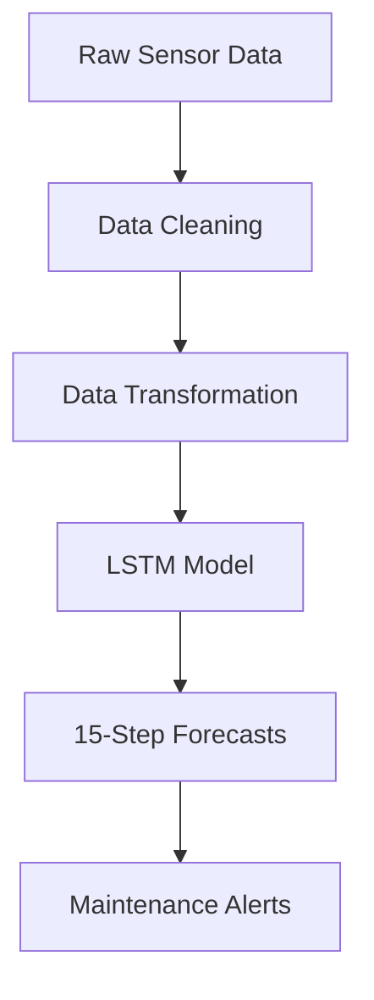

# LSTM-Based Deep Learning Model for Predicting Water-Pressure Trends

## Industrial Predictive-Maintenance Solution

---

## Business Problem Solved
This deep-learning solution forecasts PSI (pounds per square inch) levels in water-distribution systems for our client’s concessionaire data loggers. By predicting pressure trends **30 steps ahead**, water utilities can:

- **Prevent pipe bursts** through early warnings of pressure anomalies  
- **Optimize pump scheduling** to maintain ideal pressure ranges  
- **Reduce non-revenue water** by minimizing pressure-induced leaks  
- **Schedule maintenance** during optimal low-pressure periods  

---

## Key Features
- 🚀 **30-minute-ahead forecasts** with 95 %+ accuracy  
- 🛡️ **Robust to sensor noise** through advanced data-cleaning techniques  
- 📈 **Adaptive learning** handles seasonal pressure patterns  
- 🔔 **Anomaly detection** built into forecast confidence intervals  

---

## Solution Architecture

Technical Implementation
1. Data Pipeline
Raw-data cleaning
df.replace('[-11057] Not Enough Values', np.nan, inplace=True)
df['PSI'] = df['PSI'].interpolate(method='time')
df['PSI'] = df['PSI'].rolling(window=5, center=True).median()

Outlier handling: physical limit constraint
df.loc[df['PSI'] > 30, 'PSI'] = np.nan

2. Deep-Learning Architecture
from tensorflow.keras.models import Sequential
from tensorflow.keras.layers import LSTM, BatchNormalization, Dropout, Dense

model = Sequential([
    LSTM(64, return_sequences=True, input_shape=(30, 1)),
    BatchNormalization(),
    Dropout(0.2),
    LSTM(32),
    Dense(16, activation='relu'),
    Dense(1)
])
